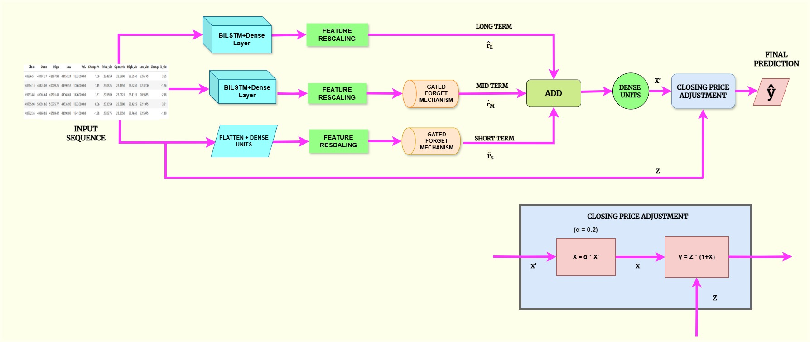
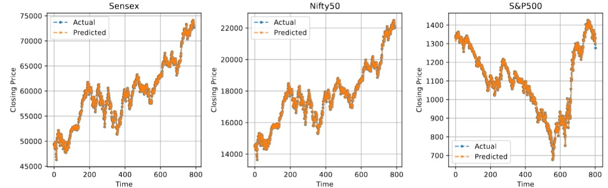

# FinStock-Net – Financial Integration of Short & Medium Trends for Stock Price Prediction - Accepted at [CICBA2025](https://www.cicba.in/home)

Authors : Anubhab Bhattacharya, Abir Chakraborty, Soham Mandal , Aritra Chatterjee, Utathya Aich and Ram Sarkar

This is the official implementation of "FinStock-Net – Financial Integration of Short & Medium Trends for Stock Price Prediction".


### Proposed workflow:


## Abstract
The stock market serves as a fundamental pillar of the global financial ecosystem, influencing macroeconomic stability and investment strategies. Among various financial indicators, the closing price is a crit-
ical metric, encapsulating aggregated market sentiment and informing risk assessment, portfolio optimization, and algorithmic trading. Despite its significance, precise forecasting of closing prices remains a formidable challenge due to the stochastic nature of financial markets, characterized by high volatility, non-stationarity, and susceptibility to exogenous economic shocks. We propose FinStock-Net, a multi-scale temporal fusion model that leverages Bidirectional Long Short-Term Memory (BiLSTM) networks for temporal analysis and a gated fusion mechanism to balance short-term (1-day), mid-term (7-day), and long-term (15-day)
market dynamics, aligning with real-world decision-making. Our frame work also integrates volatility-sensitive indicators, called VIX index, to enhance robustness against abrupt fluctuations. Unlike conventional ap-
proaches. FinStock-Net employs adaptive gating mechanisms to dynamically reweight temporal features, ensuring contextual alignment with real-world decision-making horizons. We benchmark FinStock-Net on
publicly available financial datasets like Nifty50, Sensex, and S&P500, demonstrating its superior predictive accuracy over some existing models and establishing it as a robust framework for stock market forecasting.


### Sample DRASU-Net Predictions

<p>
  
</p>


## Citation: ( Will be updated )
Please do cite our paper in case you find it useful for your research.<br/>
If you're using this article or code in your research or applications, please consider citing using this BibTeX:<br/>
```
@inproceedings{Bhattacharya2025finstocknet,
  title={FinStock-Net – Financial Integration of Short & Medium Trends for Stock Price Prediction},
  author={ Bhattacharya Anubhab, Chakraborty Abir , Mandal Soham  , Chatterjee Aritra , Aich Utathya  and Sarkar Ram },
  ConferenceTitile={CICBA2025},
  year={2025},
  note={Accepted for publication}
}
```
<br/>
